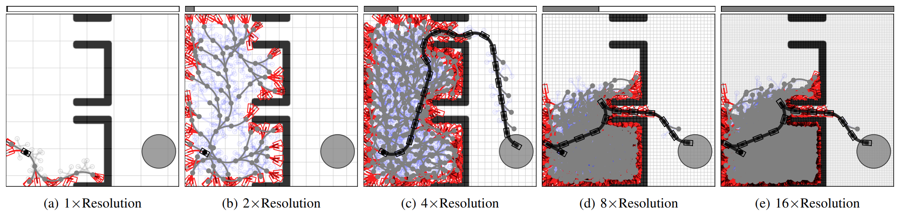

# IGHAStar

## IGHAStar: Incremental Generalized Hybrid A* Search

<figure align="center">
  
  <figcaption><b>Fig. 1:</b> The issue with Hybrid A* Search. Too coarse grid resolution risks failure (a), while too fine leads to excessive expansions and slow planning (e).</figcaption>
</figure>
<br>
<br>
We address the problem of efficiently organizing
search over very large trees, which arises in many applications
such as autonomous driving, aerial vehicles, and so on; here, we
are motivated by off-road autonomy, where real-time planning is
essential. 
Classical approaches use graphs of motion primitives
and exploit dominance to mitigate the curse of dimensionality
and prune expansions efficiently. However, for complex dynamics,
repeatedly solving two-point boundary-value problems makes
graph construction too slow for fast kinodynamic planning.
Hybrid A* (HA*) addressed this challenge by searching over a
tree of motion primitives and introducing approximate pruning
using a grid-based dominance check. 
However, choosing the grid
resolution is difficult: too coarse risks failure (Fig. 1(a)), while too fine
leads to excessive expansions and slow planning (Fig. 1(e)).
To overcome this, we propose Incremental Generalized Hybrid A* (IGHA*), an 
anytime tree-search framework that dynamically organizes vertex expansions
without rigid pruning. 
IGHA* provably matches or outperforms HA*, and has been tested in both simulation (Fig. 2, left) and in the real world on a 
small scale off-road platform (Fig. 2, right).

<p align="center">
  
<table>
  <tr>
    <td></td>
    <td></td>
  </tr>
  <tr>
    <td colspan="2" align="center"><b>Fig. 2:</b> IGHAStar in simulation (left) and real-world testing on a small-scale off-road platform (right).</td>
  </tr>
</table>

</p>
Generally speaking, IGHA* will find better paths given the same compute budget, 
compared to a smart multi-resolution version of HA* (HA*M), 
which produces suboptimal (looping) paths, visible in the simulation comparison.<br><br>

Note that IGHA*'s main dependency is Pytorch; other dependencies are for data I/O 
and display.
The code for IGHA* is written in C++ ([src/ighastar.cpp](src/ighastar.cpp)), and we use CUDA for edge evaluation and expansion.
We use [Pytorch C++/CUDA](https://docs.pytorch.org/tutorials/advanced/cpp_custom_ops.html#cpp-custom-ops-tutorial)
to handle all of the compilation and python binding.
This allows us to get the performance of C++/CUDA with the abstraction of Python/Pytorch.
The first time you run the planner, it will cache all the compiled objects for future use.

### Compute Environment Selection

For the standalone examples, the system automatically detects CUDA availability:
- If CUDA is available: Uses GPU-accelerated planning
- If CUDA is not available: Falls back to CPU implementation


## Installation

### 1. Clone the Repository
```bash
git clone https://github.com/sidtalia/IGHAStar.git
cd IGHAStar
```

### 2. Set Up Conda Environment
```bash
conda env create -f ighastar.yml
conda activate ighastar
```

## Usage

### Running the Standalone Example

The main example script supports different planning modes through configuration files:

```bash
# Use default kinematic configuration
python examples/standalone/example.py

# Specify a different configuration file
python examples/standalone/example.py --config Configs/kinodynamic_example.yml

# Use simple planning configuration
python examples/standalone/example.py --config Configs/simple_example.yml

# Use a specific test case
python examples/standalone/example.py --config Configs/kinematic_example.yml --test-case case2
```

### Configuration

Configuration files are located in `examples/standalone/Configs/` and include:

- **Vehicle Parameters**: Length, width, steering limits, velocity constraints
- **Planning Parameters**: Resolution, tolerance, epsilon values, expansion limits
- **Environment Settings**: Map resolution, timesteps, control discretization

For detailed configuration and usage instructions, see [examples/standalone/README.md](examples/standalone/README.md).

## Project Structure

```
IGHAStar/
├── src/                  # Core C++/CUDA source files
│   ├── ighastar.cpp      # Main IGHA* implementation
│   └── Environments/     # Environment implementations
│       ├── *.h           # Header files
│       ├── *.cu          # CUDA implementations
│       └── *.cpp         # CPU implementations
├── examples/             # Example scripts and configurations
│   ├── standalone/       # Standalone examples
│   │   ├── example.py    # Main example script
│   │   ├── README.md     # Detailed usage guide
│   │   ├── Configs/      # Configuration files
│   │   └── Maps/         # Map files
│   └── *.py              # Other example scripts
├── scripts/              # Utility scripts
├── Content/              # Figures and media files
├── ighastar.yml          # Conda environment file
└── README.md             # This file
```

## Contributing

1. Fork the repository
2. Create a feature branch
3. Make your changes
4. Test with both CPU and GPU environments
5. Submit a pull request
