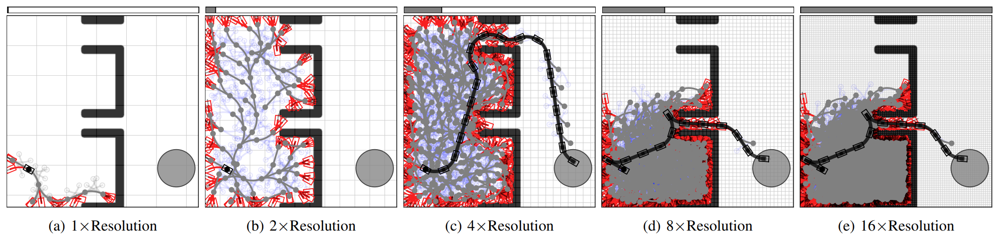
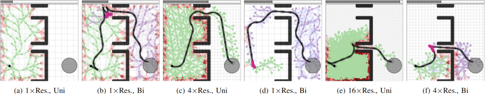
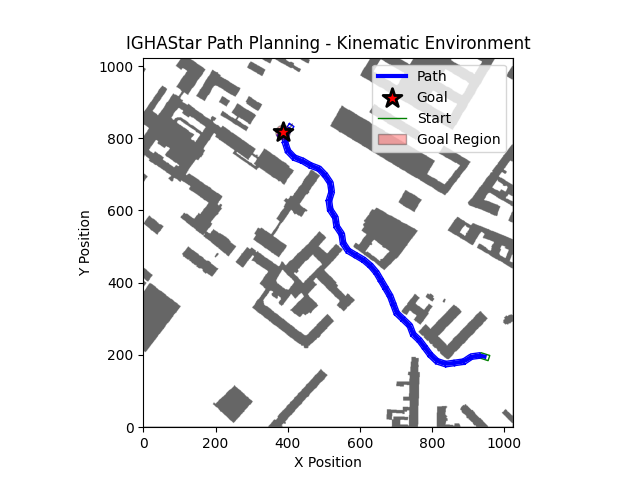
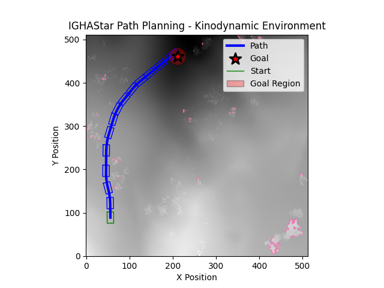
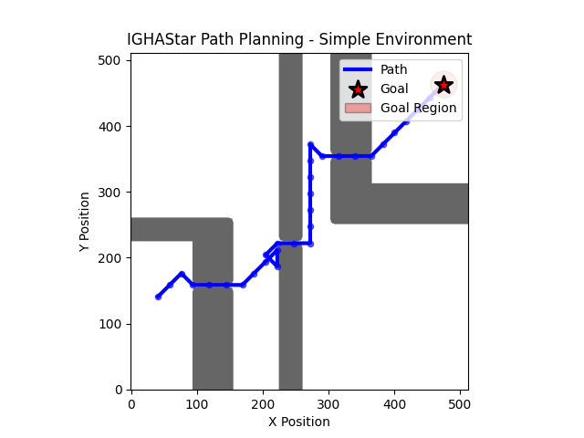
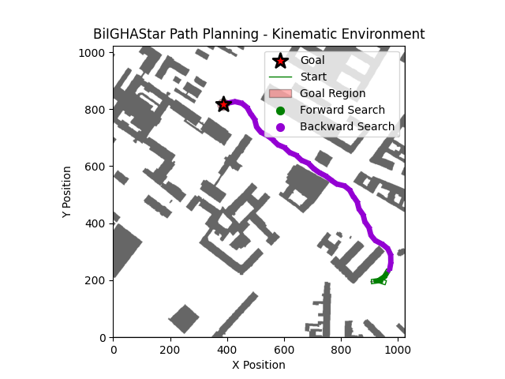
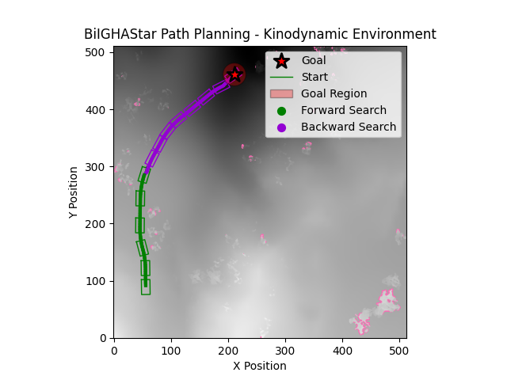
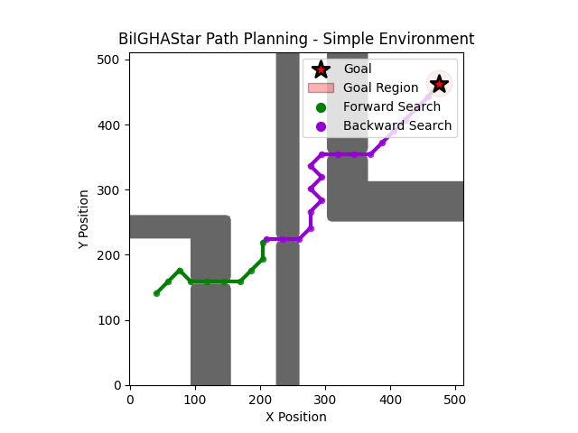

<div align="center">

# IGHA*: Incremental Generalized Hybrid A* Search 

## ([Website](https://personalrobotics.github.io/IGHAStar/), Accepted to IEEE RA-L Nov 2025, [Preprint](https://personalrobotics.cs.washington.edu/publications/talia2025ighastar.pdf))

</div>

<figure align="center">
  
  <figcaption><b>Fig. 1:</b> The issue with Hybrid A* Search. Too coarse grid resolution risks failure (a), while too fine leads to excessive expansions and slow planning (e).</figcaption>
</figure>
<br>
<br>
We address the problem of efficiently organizing
search over very large trees, which arises in many applications
such as autonomous driving, aerial vehicles, and so on; here, we
are motivated by off-road autonomy, where real-time planning is
essential. 
Classical approaches use graphs of motion primitives
and exploit dominance to mitigate the curse of dimensionality
and prune expansions efficiently. However, for complex dynamics,
repeatedly solving two-point boundary-value problems makes
graph construction too slow for fast kinodynamic planning.
Hybrid A* (HA*) addressed this challenge by searching over a
tree of motion primitives and introducing approximate pruning
using a grid-based dominance check. 
However, choosing the grid
resolution is difficult: too coarse risks failure (Fig. 1(a)), while too fine
leads to excessive expansions and slow planning (Fig. 1(e)).
To overcome this, we propose Incremental Generalized Hybrid A* (IGHA*), an 
anytime tree-search framework that dynamically organizes vertex expansions
without rigid pruning. 
IGHA* provably matches or outperforms HA*, and has been tested in both simulation (Fig. 2, left) and in the real world on a 
small scale off-road platform (Fig. 2, right). We also provide **BiIGHA***, a bidirectional variant that searches from both start and goal simultaneously, further reducing expansions in many scenarios.

<p align="center">
  
<table>
  <tr>
    <td></td>
    <td></td>
  </tr>
  <tr>
    <td colspan="2" align="center"><b>Fig. 2:</b> IGHA* in simulation (left) and real-world testing on a small-scale off-road platform (right).</td>
  </tr>
</table>

</p>
Generally speaking, IGHA* will find better paths given the same compute budget, 
compared to a smart multi-resolution version of HA* (HA*M), 
which produces suboptimal (looping) paths, visible in the simulation comparison.<br><br>

### Bidirectional IGHA* (BiIGHA*)
<figure align="center">
  
  <figcaption><b>Fig. 3:</b> Comparison of IGHA* (Uni) and BiIGHA* (Bi). At the base resolution, IGHA* fails (a), whereas BiIGHA*'s backward search succeeds (b). IGHA* must refine the resolution to obtain first a suboptimal (c) then optimal solution (e). In contrast, BiIGHA* recovers equivalent-cost solutions at lower resolutions via near-meets (d, f), using far fewer expansions.</figcaption>
</figure>
<br>
<br>
IGHA*'s key innovation is *freezing* vertices for later iterations rather than pruning them outright. However, these frozen vertices can temporarily hide solution-supporting vertices from the search. BiIGHA* extends IGHA* with bidirectional search to mitigate this effect. Beyond the classical benefit of reduced search depth, searching from both start and goal fundamentally reduces the impact of frozen vertices obscuring solutions (Fig. 4, Left). BiIGHA* preserves IGHA*'s guarantees on monotonic cost improvement and termination, while empirically requiring significantly fewer expansions across a range of planning problems.

<p align="center">

<table>
  <tr>
    <td></td>
    <td></td>
  </tr>
  <tr>
    <td colspan="2" align="center"><b>Fig. 4:</b> (Left) 3-DoF benchmark showing how bidirectional search mitigates the frozen vertex barrier, (Right) BiIGHA* (top) vs IGHA* (bottom) in simulation.</td>
  </tr>
</table>

</p>

In practice this translates to the planner being able to produce good solutions even with tighter computational budgets, under which IGHA* would not produce any solution (shown in the simulation comparison gif, Fig. 4 Right).
To demonstrate the difference in computational requirement, the examples we provide run with much fewer expansions when you use the --bidirectional flag. The expansion limit used is shown in green text on the command line.

Note that IGHA*'s main dependency is Pytorch; other dependencies are for data I/O 
and display.
The code for IGHA* is written in C++ ([src/ighastar.cpp](src/ighastar.cpp)), and we use CUDA for edge evaluation and expansion.
We use [Pytorch C++/CUDA](https://docs.pytorch.org/tutorials/advanced/cpp_custom_ops.html#cpp-custom-ops-tutorial)
to handle all of the compilation and python binding.
This allows us to get the performance of C++/CUDA with the abstraction of Python/Pytorch.
The first time you run the planner, it will cache all the compiled objects for future use.

### Compute Environment Selection

For the standalone examples, the system automatically detects CUDA availability:
- If CUDA is available: Uses GPU-accelerated planning
- If CUDA is not available: Falls back to CPU implementation


## Installation
### Note: This has currently only been tested on Ubuntu 20.04. Use virtual environments for initial testing.

### 1. Clone the Repository (recommended way is to clone just the main)
```bash
git clone --single-branch --branch main https://github.com/personalrobotics/IGHAStar.git
cd IGHAStar
```

### 2. Set Up Conda Environment (Recommended for avoiding version conflicts/spurious re-installs of packages, but not absolutely necessary)
```bash
conda env create -f ighastar.yml
conda activate ighastar
```

### 3. Install the Package
Install the IGHA* package in editable mode:
```bash
pip install -e .
```

**Note:** This step is required to make the IGHA* modules importable from anywhere in your environment.

**Python version:** IGHA* requires Python 3.8+. On many Ubuntu systems, `python` still points to Python 2.7 — use `python3` to run the examples below.

## Usage

### Running the Standalone Example
<p align="center">
  <table>
    <tr>
      <td></td>
      <td></td>
      <td></td>
    </tr>
    <tr>
      <td colspan="3" align="center"><b>Fig. 5:</b> Example planning results: Kinematic planning on urban streets (left), Kinodynamic planning on off-road terrain (middle), and Simple planning on generated maps (right).</td>
    </tr>
  </table>
</p>
The main example script supports different planning modes through configuration files:

```bash
# Use default kinematic configuration
python3 examples/standalone/example.py

# Specify a different configuration file
python3 examples/standalone/example.py --config Configs/kinodynamic_example.yml

# Use simple planning configuration
python3 examples/standalone/example.py --config Configs/simple_example.yml

# Use a specific test case
python3 examples/standalone/example.py --config Configs/kinematic_example.yml --test-case case2
```

#### Bidirectional Search (BiIGHA*)

To use bidirectional search, add the `--bidirectional` flag:

```bash
# Bidirectional kinematic planning
python3 examples/standalone/example.py --bidirectional

# Bidirectional kinodynamic planning
python3 examples/standalone/example.py --config Configs/kinodynamic_example.yml --bidirectional

# Bidirectional simple planning
python3 examples/standalone/example.py --config Configs/simple_example.yml --bidirectional
```

<p align="center">
  <table>
    <tr>
      <td></td>
      <td></td>
      <td></td>
    </tr>
    <tr>
      <td colspan="3" align="center"><b>Fig. 6:</b> BiIGHA* results: Green path segments are from forward search, blue from backward search.</td>
    </tr>
  </table>
</p>

For detailed configuration and usage instructions, see [examples/standalone/README.md](examples/standalone/README.md).
For information on how to create your own Environment, see [ighastar/Environments/README.md](ighastar/src/Environments/README.md)

For the ROS and BeamNG examples, see [examples/ROS/README.md](examples/ROS/README.md) and [examples/BeamNG/README.md](examples/BeamNG/README.md). The BeamNG README contains detailed documentation on [bidirectional search parameters](examples/BeamNG/README.md#bidirectional-search-parameters).


## Project Structure

```
IGHAStar/
├── ighastar/                   # Main package directory
│   ├── src/                    # Core C++/CUDA source files
│   │   ├── ighastar.cpp        # Main IGHA* C++ implementation
│   │   ├── utils/              # Utility headers
│   │   │   ├── config_utils.h
│   │   │   └── sampling_utils.h
│   │   └── Environments/       # Environment implementations
│   │       ├── include/        # Header files (*.h)
│   │       ├── src/            # CUDA (*.cu) and CPU (*.cpp) implementations
│   │       └── README.md       # Environment documentation
│   └── scripts/                # Utility scripts
│       └── common_utils.py     # Common utilities (create_planner, etc.)
├── examples/                   # Example scripts and configurations
│   ├── standalone/             # Standalone examples (no external dependencies)
│   │   ├── example.py          # Main example script
│   │   ├── utils.py            # Standalone utilities
│   │   ├── README.md           # Detailed usage guide
│   │   ├── Configs/            # Configuration files (*.yml)
│   │   └── Maps/               # Map files (Offroad, street-png, generated)
│   ├── BeamNG/                 # BeamNG simulator integration
│   │   ├── example.py          # BeamNG example script
│   │   ├── IGHAStarMP.py       # Multiprocessing planner wrapper
│   │   ├── TrackingCost.py     # MPC cost function
│   │   ├── utils.py            # BeamNG utilities
│   │   ├── README.md           # BeamNG setup guide
│   │   ├── Configs/            # Configuration files (*.yaml)
│   │   └── Waypoints/          # Waypoint files
│   └── ROS/                    # ROS integration
│       ├── example.py          # ROS example node
│       ├── utils.py            # ROS utilities
│       ├── README.md           # ROS setup guide
│       ├── Configs/            # Configuration files (*.yml)
│       └── rosbags/            # Sample rosbags
├── tests/                      # Test suite
│   ├── unit/                   # Unit tests
│   │   ├── core/               # Core functionality tests
│   │   └── environments/       # Environment tests
│   └── README.md               # Testing documentation
├── Content/                    # Figures and media files
│   ├── standalone/             # Standalone example images
│   ├── BeamNG/                 # BeamNG example images
│   └── ROS/                    # ROS example images
├── ighastar.yml                # Conda environment file
├── pyproject.toml              # Package configuration
└── README.md                   # This file
```

## Contributing

1. Fork the repository
2. Create a feature branch
3. Make your changes
4. Format your code:
   - For C++ files, use [clang-format](https://clang.llvm.org/docs/ClangFormat.html) to ensure consistent style.
     - Example: `clang-format -i path/to/file.cpp`
   - For Python files, use [black](https://black.readthedocs.io/en/stable/) for code formatting.
     - Example: `black path/to/file.py`
   - Use [PEP 484](https://peps.python.org/pep-0484/) type hints for all Python functions and methods.
5. Test with both CPU and GPU environments (if that applies)
6. Submit a pull request
