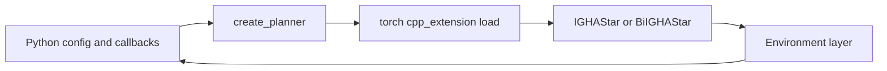

# Extending IGHAStar

## Choose an integration path

```
Need a new planning problem?
├── Python dynamics + collision in callbacks
│   └── Generic environment (recommended) → generic_environment.md
├── GPU costmap car on 2D elevation/cost maps
│   └── Copy kinematic / kinodynamic .h + .cu pattern → Environments/README.md
└── Fixed custom C++ representation (max performance)
    └── Implement Environment interface in C++ → Environments/README.md
```

| Path | Effort | Performance | Flexibility |
|------|--------|-------------|-------------|
| Generic (Python callbacks) | Low | Moderate (CPU callbacks) | High |
| Built-in car env | None (use YAML) | High (CUDA) | 2D maps + car dynamics only |
| Custom C++ env | High | Highest | Full control |

## Software architecture



1. **Python** loads YAML, attaches callbacks (generic) or map tensors (car).
2. **`create_planner()`** JIT-compiles [ighastar.cpp](../ighastar/src/ighastar.cpp) with the selected environment macro.
3. **IGHAStar / BiIGHAStar** run anytime tree search (resolution scheduling, optional bidirectional meet).
4. **Environment** implements successors, heuristics, validity, and goal checks—either in CUDA (car) or via Python callbacks (generic).

## Generic environment (most users)

Define your problem with six Python functions. No C++ changes.

- Guide: [generic_environment.md](generic_environment.md)
- Example: [generic_integrator.py](../examples/standalone/generic_integrator.py)

## Built-in car environments

For 2D costmap + elevation planning with discrete steering/throttle:

- `node_type: "kinematic"` — SE(2) with velocity slot
- `node_type: "kinodynamic"` — full velocity + terrain dynamics
- `node_type: "simple"` — 2D grid, header-only

Configure via YAML; see [examples/standalone/README.md](../examples/standalone/README.md).

## Custom C++ environment

Implement the `Environment` and `Node` interfaces documented in [ighastar/src/Environments/README.md](../ighastar/src/Environments/README.md):

- `Succ`, `heuristic`, `reached_goal_region`, `check_validity`, ...
- CUDA (`.cu`) + CPU (`.cpp`) variants for GPU/CPU parity
- Wire into [common_utils.py](../ighastar/scripts/common_utils.py) with a new `node_type` macro

Use this path when you need maximum throughput and a fixed problem structure that will not change at runtime.

## Integration into a larger stack

| Stack | Example | What to copy |
|-------|---------|--------------|
| Standalone script | [example.py](../examples/standalone/example.py) | `create_planner` → `search` → `get_best_path` |
| ROS node | [examples/ROS/example.py](../examples/ROS/example.py) | Topic callbacks, map tensor assembly |
| Simulator loop | [examples/BeamNG/example.py](../examples/BeamNG/example.py) | Multiprocess planner + MPPI tracking |

See [examples.md](examples.md) for friction tiers.

## Algorithm background

IGHA*'s resolution scheduling, frozen vertices, and BiIGHA* near-meets are explained on the [project website](https://personalrobotics.github.io/IGHAStar/)—not duplicated here.
