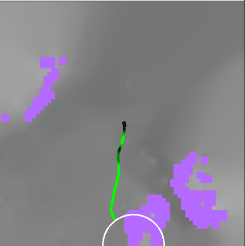

# IGHAStar ROS Example

This folder contains a ROS-based example for the IGHA* path planner. The code here is really an example script to demonstrate how one would use the planner in the loop on their robot. 
It demonstrates how to integrate the IGHA* planner with ROS topics for maps, odometry, waypoints, and visualization.
For simplicity (not needing to fiddle with rviz), there is a built in visualization in the example.
It is however not a "ros-package"; one can use the example shown here as a stencil to incorporate IGHA* into their navigation stack.


## Prerequisites
- ROS Noetic
- Python 3
- IGHAStar C++/CUDA requirements (met with pip install -e .)

## Setup (confirm these instructions)
1. **Install ROS dependencies:**
   Assuming IGHA* has already been installed,
   ```bash
   # Install ROS packages for message types
   sudo apt-get update
   sudo apt-get install ros-noetic-grid-map-msgs \
                        ros-noetic-mavros-msgs \
                        ros-noetic-nav-msgs \
                        ros-noetic-geometry-msgs \
                        ros-noetic-sensor-msgs \
                        ros-noetic-visualization-msgs \
                        ros-noetic-diagnostic-msgs \
                        ros-noetic-tf
   
   # Check for any missing dependencies
   rosdep install --from-paths src --ignore-src -r -y
   ```

2. **Verify installation:**
   ```bash
   # Test that all message types are available
   python3 -c "
   import rospy
   from nav_msgs.msg import Path, Odometry
   from mavros_msgs.msg import WaypointList
   from grid_map_msgs.msg import GridMap
   from visualization_msgs.msg import MarkerArray
   from sensor_msgs.msg import NavSatFix
   from diagnostic_msgs.msg import DiagnosticArray
   from geometry_msgs.msg import PoseStamped, Quaternion
   print('All ROS message types imported successfully!')
   "
   ```

## Configuration
- Edit `Configs/ros_example.yml` to set planner parameters, topic names, and costmap settings.

## Running the Example


<figure align="center">
  
  <figcaption><b>Fig. 1:</b> Example ROS planner visualization. The window shows the costmap (pink/white), elevation map (grayscale), the planned path (green), the goal (white circle), and the robot state (black rectangle).</figcaption>
</figure>

We provide rosbags that you can use to run the example script. Place them in the `rosbags` folder. Download here: [rosbag 1](https://drive.google.com/file/d/1zV0f3NbPuyewwbHUlrcuboj-PMrPixwG/view?usp=sharing), [rosbag 2](https://drive.google.com/file/d/1BPsypv83_W5EtcodyV2W75BSK3rVE3mX/view?usp=sharing)

1. **Start ROS core:**
   ```bash
   roscore
   ```
2. **Run the planner node:**
   ```bash
   python3 examples/ROS/example.py
   ```
3. **Play a rosbag or run your robot simulation** to publish the required topics.
   ```
   cd examples/ROS/rosbags/
   rosbag play hound_95.bag
   ```

## Visualization
- The planner will open an OpenCV window showing the costmap, elevation map, path, goal, and robot state.
- Path and goal are also published as ROS topics for use in RViz.
