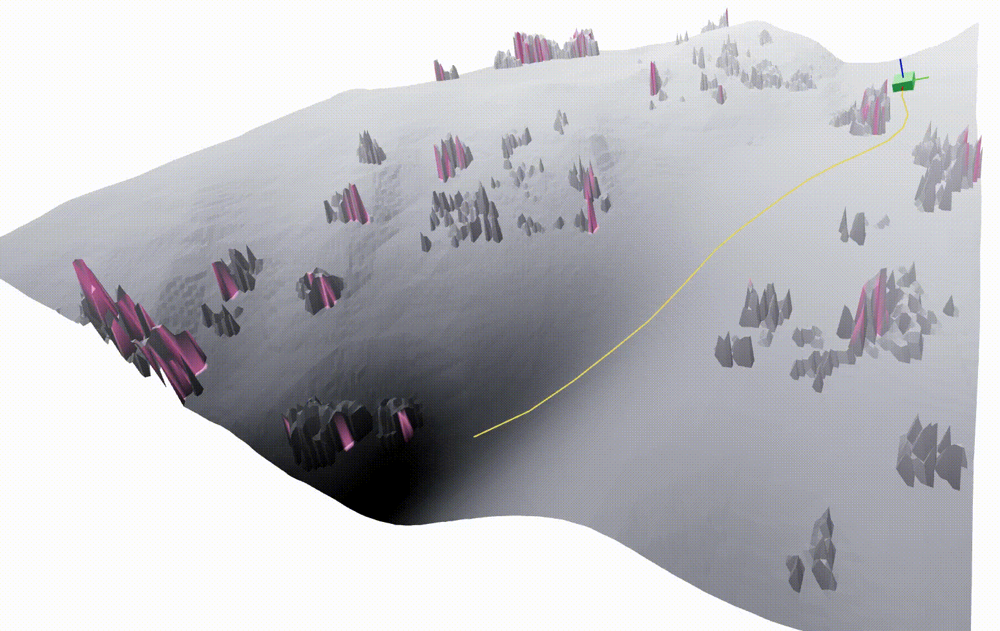

# Example Usage Guide

This document explains how to configure and use IGHAStar for different planning scenarios.

## Configuration Files

Configuration files are located in `examples/standalone/Configs/` and include:

- **Vehicle Parameters**: Length, width, maximum velocity, steering limits
- **Planning Parameters**: Resolution, tolerance, epsilon values
- **Environment Settings**: Map resolution, timesteps, control discretization

### Available Configuration Files
- `kinematic_example.yml` - Kinematic planning configuration
- `kinodynamic_example.yml` - Kinodynamic planning configuration  
- `simple_example.yml` - Simple planning configuration
- `ros_kinodynamic_example.yml` - ROS integration configuration

## ESDF Terrain Queries and Viser Demo

The kinodynamic planner can use three terrain representations. Selection is entirely through configuration; the vehicle dynamics and search algorithm are unchanged.

| `map_type` | World tensor | Height query | Traversability query |
|---|---|---|---|
| `elevation` (default) | `H x W x 2` (costmap, heightmap) | elevation map | costmap |
| `esdf_bev` | `H x W x 2` (flattened once from ESDF) | elevation map | costmap |
| `esdf` | `H x W x nz x 4` (distance, R, G, B) | live ESDF zero-crossing | live ESDF color luminance |

`esdf_bev` is the recommended ESDF path for planning: a standalone CUDA utility (`ighastar.scripts.esdf_bev`) flattens the dense colored ESDF into a fixed BEV once, then the planner uses the fast 2D elevation backend. Live `esdf` queries remain available for debugging. Both ESDF modes require CUDA. The CPU kinodynamic environment supports elevation maps only.

### Optional dependencies

```bash
# From the repository root
pip install -e ".[viz]"
```

This installs `scipy` (synthetic ESDF construction), `viser` (3D debug views), and `trimesh` (terrain meshes in the replay).

### Configuration

In `Configs/kinodynamic_example.yml`:

```yaml
node_info:
  node_type: "kinodynamic"
  map_type: "elevation"   # or "esdf_bev" / "esdf"
  esdf:                   # used when map_type is "esdf" or "esdf_bev"
    voxel_z: 0.25
    z_margin: 1.0
    method: "plane"       # "plane" (sub-voxel surface) or "edt"
    cache: "Maps/Offroad/race-2_esdf.npz"
```

### 1. Build and inspect the synthetic ESDF

The synthetic ESDF is generated from the same elevation map and costmap the planner already uses. Geometry comes from the heightmap; obstacles are encoded as black (obstacle) / white (free) colour voxels.

```bash
cd examples/standalone

# Build the ESDF, write the cache, and open a Viser inspector
python3 make_synthetic_esdf.py -c Configs/kinodynamic_example.yml
```

Open **http://localhost:8080** in a browser. The scene shows near-surface ESDF voxels coloured by the traversability layer, plus reference images of the source elevation map and costmap. Use the GUI checkboxes to toggle the recovered surface and a distance slice along z.

Useful flags:

```bash
# Build/cache only (no browser view)
python3 make_synthetic_esdf.py -c Configs/kinodynamic_example.yml --no-viser

# Override voxel size or use a different Viser port
python3 make_synthetic_esdf.py -c Configs/kinodynamic_example.yml --voxel-z 0.25 --port 8080
```

If the cache at `Maps/Offroad/race-2_esdf.npz` is missing when you plan with `map_type: esdf` or `esdf_bev`, `example.py` will build it automatically on first load.

### 2. Plan with an ESDF-derived BEV

Set `map_type: "esdf_bev"` in `Configs/kinodynamic_example.yml`, then:

```bash
cd examples/standalone

# Flatten ESDF → BEV once, plan on the fast 2D path, optional Viser replay
python3 example.py --config Configs/kinodynamic_example.yml --test-case case1 --viser
```

For live 3D ESDF queries instead (slower; useful for debugging), set `map_type: "esdf"`.

Without `--viser`, the usual matplotlib plot is still shown, and the path is also saved under `Content/standalone/` as `*_path.npy` for later replay.

Switch back to the elevation pipeline at any time by setting `map_type: "elevation"` (or removing the key); existing configs keep working.

### 3. Replay a saved trajectory in Viser

```bash
cd examples/standalone

# Replay over the ESDF
python3 viser_replay.py -c Configs/kinodynamic_example.yml \
  --map-type esdf --port 8081 \
  --path ../../Content/standalone/race-2_kinodynamic_esdf_IGHAStar_path.npy

# Replay the same path over the elevation map (side-by-side comparison)
python3 viser_replay.py -c Configs/kinodynamic_example.yml \
  --map-type elevation --port 8082 \
  --path ../../Content/standalone/race-2_kinodynamic_esdf_IGHAStar_path.npy
```

Open the printed localhost URL. The GUI has play/pause, a state slider, and a live readout of body height, roll, pitch, and velocity. Paths from `get_best_path()` are goal-first; the replay reverses them so the vehicle drives start → goal.

<p align="center">
  
  <br>
  <em>Viser replay: vehicle following a planned trajectory over the terrain.</em>
</p>

## Modifying Start and Goal Points

To change the start and goal positions for path planning, you can either:

1. **Edit the configuration file** to modify the default start/goal or add test cases
2. **Use the `--test-case` argument** to select from predefined test cases

### Configuration File Structure

**For Kinematic Planning:**
```yaml
map:
  name: "Berlin_0_1024.png"
  dir: "Maps/street-png"
  start: [94.5, 19.5, 2.8284062641509644]  # [x, y, heading]
  goal: [38.7, 81.6, 0.6324707282184407]   # [x, y, heading]
  size: [1024, 1024]
  res: 0.1
  test_cases:
    case1:
      start: [94.5, 19.5, 2.8284062641509644]
      goal: [38.7, 81.6, 0.6324707282184407]
    case2:
      start: [17.6, 72.0, 0.9402905929256757]
      goal: [40.3, 16.9, 1.0911003058968491]
```

**For Kinodynamic Planning:**
```yaml
map:
  name: "race-2"
  dir: "Maps/Offroad"
  start: [5.6, 8.9, 1.5844149127199794, 4.935323678240241, 0]  # [x, y, heading, velocity, unused]
  goal: [21.1, 46.1, 0.608009209539623, 4.516091247319389, 0] # [x, y, heading, velocity, unused]
  size: [512, 512]
  res: 0.1
  test_cases:
    case1:
      start: [5.6, 8.9, 1.5844149127199794, 4.935323678240241, 0]
      goal: [21.1, 46.1, 0.608009209539623, 4.516091247319389, 0]
    case2:
      start: [11.9, 16.8, 1.3574384016819936, 3.317266656251059, 0]
      goal: [46.6, 25.0, 0.19076360687480998, 3.2507584385704855, 0]
```

### Coordinate System
- **x, y**: Position coordinates in meters
- **heading**: Orientation in radians (0 = east, π/2 = north, π = west, -π/2 = south)
- **velocity**: Speed in m/s (kinodynamic only)

## Map Files

Map files are stored in `examples/standalone/Maps/` with the following structure:
- `generated_maps/` - Procedurally generated test maps
- `street-png/` - Street network maps
- `Offroad/` - Off-road terrain maps

## Test Cases

Each configuration file can include multiple test cases with different start/goal positions. To use a specific test case:

```bash
python examples/standalone/example.py --config examples/standalone/Configs/kinematic_example.yml --test-case case2
```

If no test case is specified, the default start/goal from the configuration file will be used.

## Parameter Descriptions

### Map Parameters
- `name`: Name of the map file
- `dir`: Directory containing the map file (relative to examples/)
- `start`: Starting position [x, y, heading] or [x, y, heading, velocity, unused]
- `goal`: Goal position [x, y, heading] or [x, y, heading, velocity, unused]
- `size`: Map dimensions [width, height] in pixels
- `res`: Map resolution in meters per pixel

### Planning Parameters
- `resolution`: Starting resolution used for discretization
- `epsilon`: Goal region tolerance [ate, cte, heading, vel] - along-track error, cross-track error, heading tolerance, velocity tolerance
- `tolerance`: Minimum separation between vertices (your perception/map resolution should be at least this)
- `max_level`: Maximum level to which the system can go (used to cache hash values)
- `division_factor`: Factor by which the resolution increases every level
- `max_expansions`: Maximum number of node expansions allowed
- `hysteresis`: Hysteresis threshold for IGHA*-H algorithm

### Vehicle Parameters
- `length`: Vehicle length in meters
- `width`: Vehicle width in meters
- `steering_list`: Available steering angles in degrees
- `throttle_list`: Available throttle values (negative = reverse, positive = forward)
- `max_vel`: Maximum velocity in m/s
- `min_vel`: Minimum velocity in m/s
- `del_theta`: Maximum steering angle change in degrees
- `max_theta`: Maximum steering angle in degrees
- `del_vel`: Maximum velocity change in m/s
- `max_vert_acc`: Maximum vertical acceleration in m/s²
- `RI`: Rolling resistance coefficient
- `gear_switch_time`: Time penalty for gear switching (multiplies reverse distance)

### Terrain Representation Parameters (kinodynamic only)
- `map_type`: `"elevation"` (default), `"esdf_bev"` (flatten ESDF once via CUDA, then 2D queries), or `"esdf"` (live 3D queries)
- `esdf.voxel_z`: Vertical voxel size of the ESDF grid, in meters
- `esdf.z_margin`: Free space kept above/below the terrain when building the ESDF, in meters
- `esdf.method`: `"plane"` (default; sub-voxel exact surface) or `"edt"` (voxel-quantized Euclidean distance transform)
- `esdf.cache`: Path to the cached `.npz` ESDF (built by `make_synthetic_esdf.py` or on first load)